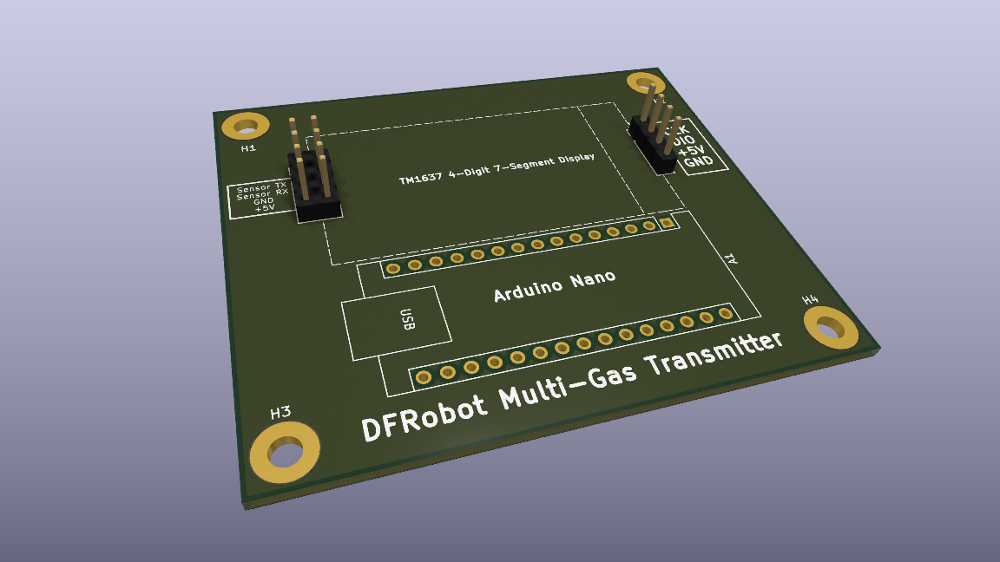
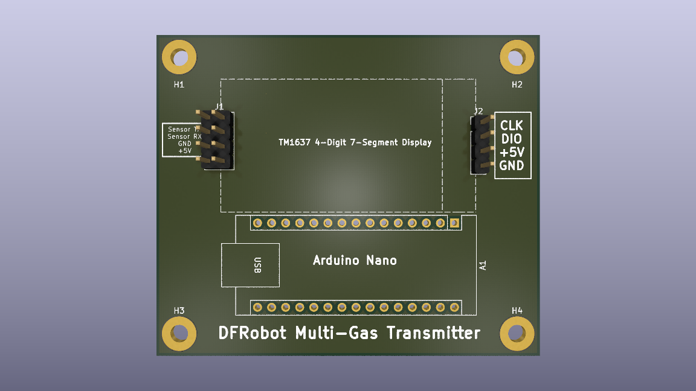
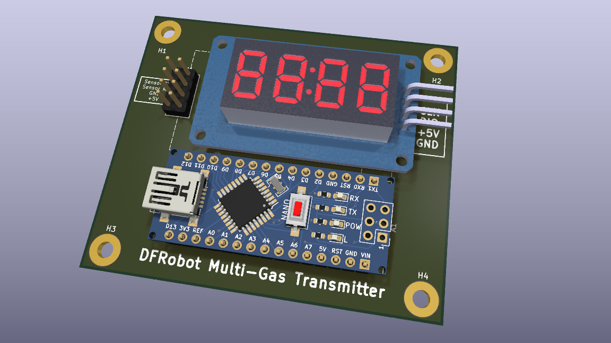
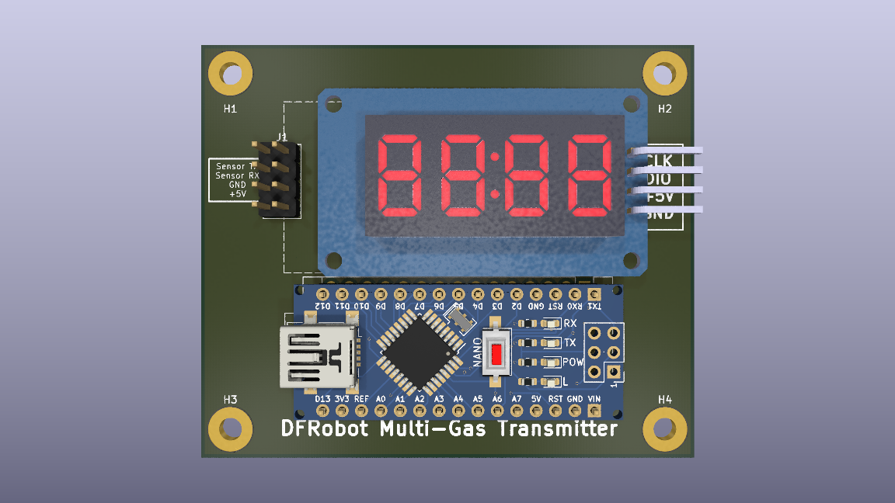

## Phase 1 Hardware Prototyping

The Phase 1 board utilizes an Arduino Nano baseboard designed for rapid validation of the TM1637 display interface and the DFRobot gas sensor lines. The traces have been widened to optimized thresholds (0.8mm–1.0mm) to allow for reliable manual mechanical isolation milling.

### Board Previews

| | |
|---|---|
|  |  |
|  |  |